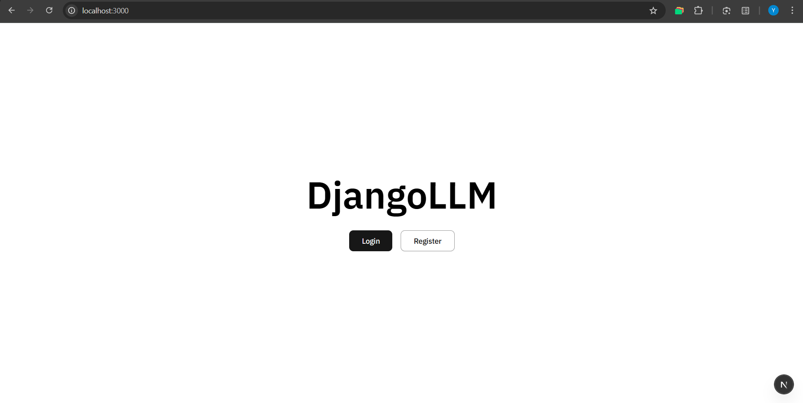
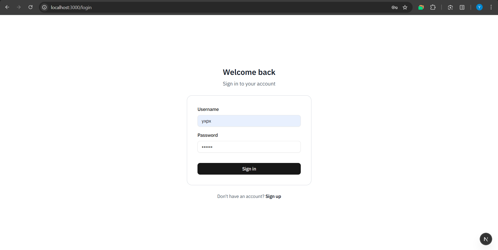
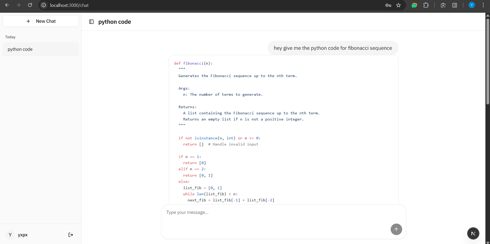

# DjangoLLM 

A basic Django + Next.js chat app using Ollama. 

## Prerequisites
- Python 3.11+ and uv
- Node.js 18+
- Ollama

## 1) Backend (Django)

From the repo root:

```pwsh
cd backend
# create & activate venv with uv
uv venv

# PowerShell activation:
. .venv\Scripts\Activate.ps1

# install deps
uv pip install -r requirements.txt

# Run migrations
python DjangoLLM/manage.py makemigrations
python DjangoLLM/manage.py migrate

# create admin user (optional)
python DjangoLLM/manage.py createsuperuser

# start server
python DjangoLLM/manage.py runserver 0.0.0.0:8000
```

- Admin panel: http://127.0.0.1:8000/admin/

## 2) Model (Ollama)

Make sure Ollama is running and the model is present:

```pwsh
ollama pull gemma3n:e2b
ollama serve
```

The backend streams responses via the Python `ollama` client to the local daemon.

## 3) Frontend (Next.js)
From the repo root:

```pwsh
cd frontend
pnpm install
pnpm dev
```

- Open http://localhost:3000
- The frontend auto-detects the backend host (localhost vs 127.0.0.1). If needed, set:

```pwsh
$env:NEXT_PUBLIC_API_URL = "http://127.0.0.1:8000"
```

## Screenshots







## Acknowledgements
- Django, Django REST framework
- shadcn/ui
- prompt‑kit
- Ollama

